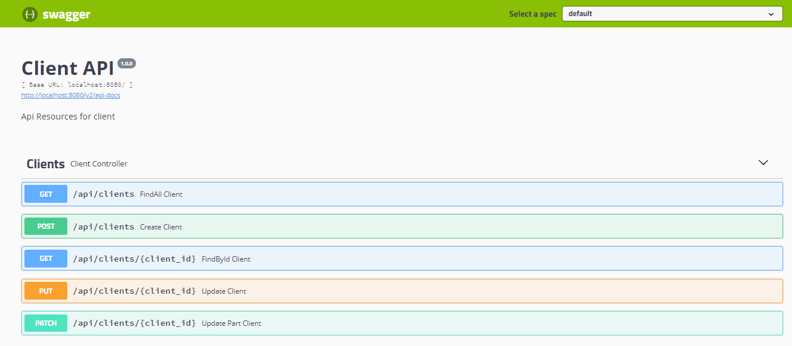
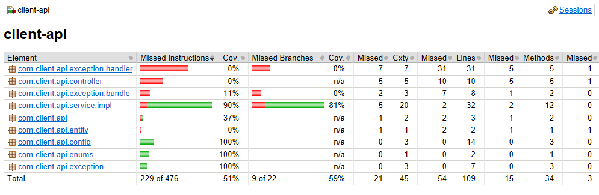

# CLIENT API

    API responsável por manter o cliente, com recursos necessários para cadastrar, alterar o recurso todo 
    ou partes além de listar os recursos por paginação ou um cliente específico.

## Init Project

    - Rodar o projeto com o comando: mvn clean install (para baixar as dependências).
    
    - O projeto foi utilizado a IDE do Eclipse.
    
    - Para rodar os testes, basta utilizar o comando: mvn clean test
    
    - Ao subir o projeto automaticamente será inserido 25 registros para testar o endpoint do findAll.
        Se não quiser utilizá-lo basta comentar no arquivo: application.yml:
        properties:
              hibernate:
                hbm2ddl:
                  import_files: data/insert_client.sql
            
## Technology and Frameworks

    - Java8
    - SpringBoot 2.3.3.RELEASE
    - Swagger 
    - Jacoco
    - JUnit5
    - Mockito
    - H2
    - Rest
    - SpringData    
    - HATEOAS
    - TravisCI
    - Heroku Nuvem

## Swagger API

    Acesse o swagger para a documentação da API.
    URL: http://localhost:8080/swagger-ui.html
    
   
    
## H2

    Temos a opção de subir a API com o banco de dados em memória.

    http://localhost:8080/h2-console

    url: jdbc:h2:mem:client_db
    username: sa
    password: sa123
    
## JACOCO PATH

    Para verificar a cobertura de testes, podemos usar o JACOCO.

  

    Caminho do arquivo:
    /client-api/target/site/jacoco/index.html    

## Collection Postman

    Importe as collections no Postman para testar a aplicação.
    
    - As collections se encontram no seguinte diretório: /docs/collections/
    
    - Variáveis do ambiente: /docs/collections/Localhost.postman_environment.json
    - Endpoints: /docs/collections/client-api.postman_collection.json
    

#client-api
